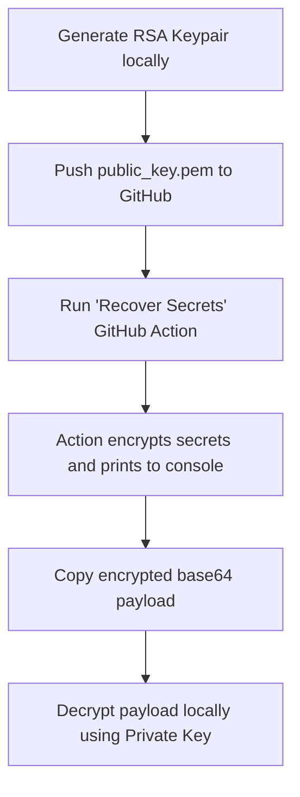

# PyPI Secret Recovery Tools

These tools allow secure, temporary recovery of repository secrets (`PYPI_API_TOKEN` and `TEST_PYPI_API_TOKEN`) using asymmetric RSA encryption.

## Workflow Overview



---

## Step-by-Step Instructions

### Step 1: Generate a Keypair Locally

Run the following command from the root of the `uas_standards` directory to generate a new RSA 2048-bit keypair:

```bash
python tools/generate_keypair.py
```

This will generate two files:
*   `private_key.pem` (In the root directory - **DO NOT COMMIT TO GIT** - automatically ignored by `.gitignore`)
*   `tools/public_key.pem` (In the `tools/` directory - **MUST BE COMMITTED TO GIT**)

### Step 2: Commit and Push the Public Key

1.  Add and commit the generated public key (`tools/public_key.pem`) along with the updated recovery scripts to Git:

    ```bash
    git add tools/public_key.pem tools/encrypt_secrets.py tools/generate_keypair.py .github/workflows/recover_secrets.yaml .gitignore tools/recovery.md
    git commit -m "Configure public key for secret recovery"
    git push
    ```

### Step 3: Run the GitHub Action

1.  Navigate to the repository page on GitHub.
2.  Click on the **Actions** tab.
3.  Select the **Recover Secrets** workflow in the left sidebar.
4.  Click **Run workflow** -> select branch -> click **Run workflow**.
5.  Wait for the run to complete, open the run logs, and expand the **Encrypt secrets and print to console** step.
6.  Copy the base64-encoded encrypted token payload (e.g., from `=== ENCRYPTED PYPI_API_TOKEN ===` to `================================`).

### Step 4: Decrypt the Secret Locally

Run the decryption script passing the base64-encoded block as an argument and referencing your private key path (defaults to `private_key.pem` if not specified):

```bash
python tools/decrypt_secret.py "YOUR_BASE64_ENCRYPTED_STRING"
```

Alternatively, you can pipe it:

```bash
echo "YOUR_BASE64_ENCRYPTED_STRING" | python tools/decrypt_secret.py -
```

The script will print the decrypted token to your terminal console.

### Step 5: Clean Up

For security, delete the local private key file when finished with recovery:
```bash
rm private_key.pem
```
Note: The public key file `tools/public_key.pem` can remain in the repository.

